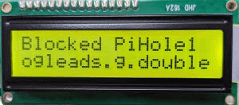

# NetworkStatus
Display of Pi-hole data to an 16x2 lcd display using an Arduino NANO 33 IoT board.

Data displayed:
 - Ads blocked today
 - Recently blocked domain
 - Top permitted & block domains
 - Cached DNS requests
 - Black list last updated date

### Example Output
 

### Run _install_build_upload script (uses arduino-cli)
- installs referenced libraries & nano board
- ouputs the port and fully qualified board name (fqbn) needed to upload
- compile and upload to microcontroller

***Rename arduino_secrets.h.example and add environment values***
